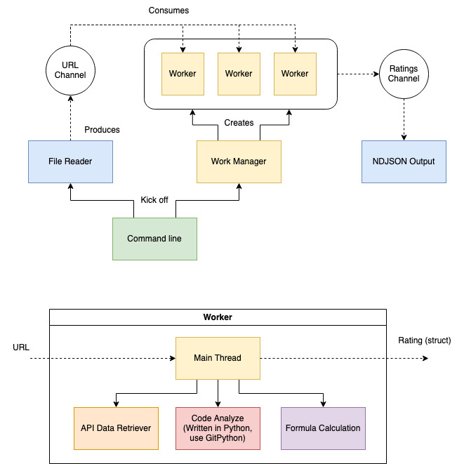

Team Members:
Mimi Chon, Anna Shen, Emile Baez, Ben Schwartz

# Building program
In command line, first run 
`go build -o "run"`
in order to create executable with 'run' as name.

# CLI
<`build`, `install`, `test`, `'URL_FILE'`> commands are recognized where 'URL_FILE' must be an absolute path to a file in the system.

# Architecture
   
This is the current architecture of our program. Each block represents a collection of functions towards a single functionality. Each color represents a package in Go.

# Helpful Commands
`go run .`   
`go build .`

# GitHub API Notes
Use environment variable "GITHUB_TOKEN" to set token

# Commands
`./run install` to install Go and Python dependencies  
`./run build`  to build the executable  

The following commands require install and build beforehand:  
`./run URL_FILE` to run main program  
`./run test` to run test cases  

# Used Stackoverflow articles
Module : Link  
cli/scanner : https://stackoverflow.com/questions/18159704/how-to-debug-exit-status-1-error-when-running-exec-command-in-golang  
worker : https://stackoverflow.com/questions/25306073/always-have-x-number-of-goroutines-running-at-any-time  
worker : https://stackoverflow.com/questions/55203251/limiting-number-of-go-routines-running  
scanner : https://stackoverflow.com/questions/2466735/how-to-sparsely-checkout-only-one-single-file-from-a-git-repository

